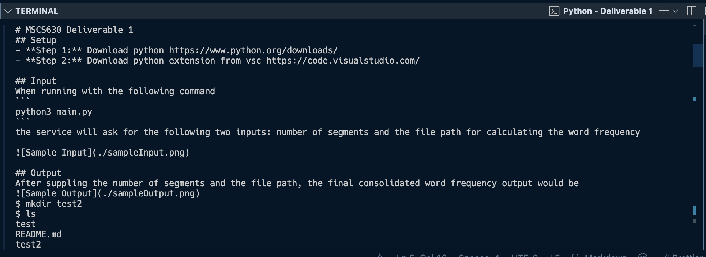

# MSCS630_Deliverable_1
## Setup
- **Step 1:** Download python https://www.python.org/downloads/
- **Step 2:** Download python extension from vsc https://code.visualstudio.com/

## Output
When running with the following command
```
python3 main.py
```
the application will ask for the corresponding shell command being supported by the application (e.g cat README.md)
