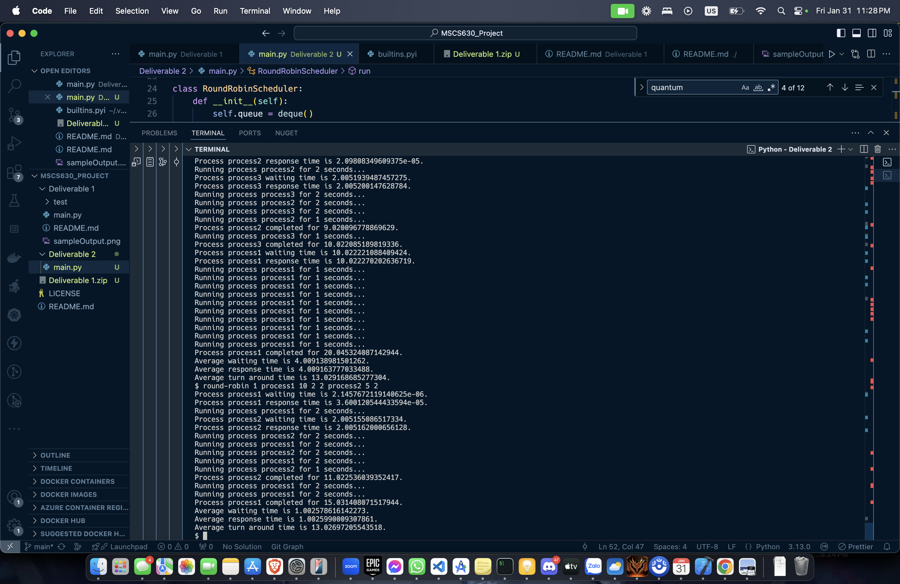

# MSCS630_Deliverable_2
## Setup
- **Step 1:** Download python https://www.python.org/downloads/
- **Step 2:** Download python extension from vsc https://code.visualstudio.com/

## Output
When running with the following command
```
python3 main.py
```
the application will ask for the corresponding shell command being supported by the application (e.g round-robin 1 process1 10 2 2 process2 5 2)


For round robin, the input will have the following format: round-robin {pid 1} {process 1 name} {process 1 duration} {process configured time}  {pid 2} {process 2 name} {process 2 duration} {process configured time}

For priority scheduling, the input will have the following format: round robin {pid 1} {process 1 name} {process 1 duration} {process configured time} {process 1 priority} {pid 2} {process 2 name} {process 2 duration} {process configured time} {process 2 priority}